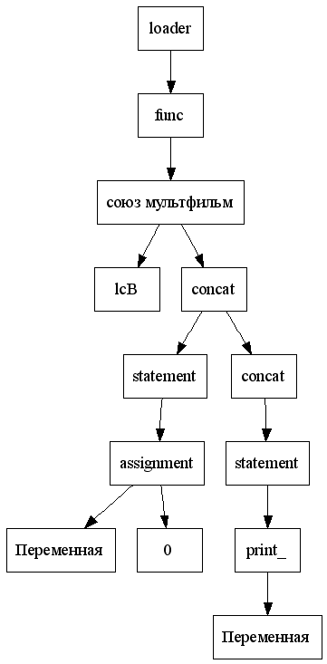

# MultLang

My own programming language with phrases of my favorite cartoon characters.

## Introduction

The last project of the 1st term in MIPT. The idea of ​​this language came to the author while, instead of programming, he was watching soviet cartoon "Carlson".

All thanks [@ded32](https://github.com/ded32).

## Implementation

The parsing is done using the recursive descent algorithm. At the end, a tree is built, which has commands as its nodes.

The tree example you may see on the image:

<p align = "center">
    
</p>


This tree was built for the following multLang program:

```
сказка союз мультфильм () {

    плюх Переменная = 0;
    нафаня, сундук украли ( Переменная );

}

эх, жизнь моя, жестянка! да ну ее в болото!

```

After building the tree, it goes through the backend: our tree is being converted into our own assembler:

```asm
союз мультфильм:
PUSH 0
POP [ 0 ]
PUSH rcx + 1
POP rcx
PUSH [ 0 ]
OUT
HLT
```

## Syntax and command list

### Syntax

The MultLang has C-like syntax. What's more: it supports verbose variables. 

`Achtung: Since the space is not just a separator in variable names but a full-fledged symbol. You have to be careful about the number of spaces in variable usage.`

### Command list:

 Command                                        | Meaning           
 :---------------------------------------------:|:-----------------------:|
 сказка                                         | function declaration
 там ещё осталось немножечко варенья            | if declaration
 не ходи туда, там тебя ждут неприятности       | while declaration
 нафаня, сундук украли                          | print standart function
 и так сойдет                                   | return statement
 щас спою                                       | scan standart function  
 море море                                      | sin
 горе горе                                      | cos
 плюх                                           | var declaration
 корешок                                        | sqrt
 эх, жизнь моя, жестянка! да ну ее в болото!    | end of program


